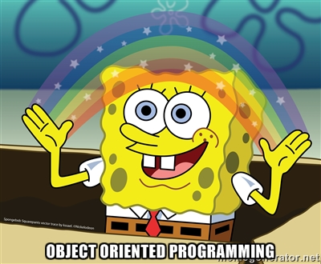

# Project: 0x06. Python - Classes and Objects



## Resources

#### Read or watch:

* [Object Oriented Programming](https://python.swaroopch.com/oop.html)
* [Object-Oriented Programming](https://python-course.eu/oop/object-oriented-programming.php)
* [Properties vs. Getters and Setters](https://python-course.eu/oop/properties-vs-getters-and-setters.php)
* [Learn to Program 9 : Object Oriented Programming](https://www.youtube.com/watch?v=1AGyBuVCTeE)
* [Python Classes and Objects](https://www.youtube.com/watch?v=apACNr7DC_s)
* [Object Oriented Programming](https://www.youtube.com/watch?v=-DP1i2ZU9gk)


### General

* Why Python programming is awesome 
* What is OOP
* “first-class everything”
* What is a class
* What is an object and an instance
* What is the difference between a class and an object or instance
* What is an attribute
* What are and how to use public, protected and private attributes
* What is <code>self</code>
* What is a method
* What is the special <code>__init__</code> method and how to use it
* What is Data Abstraction, Data Encapsulation, and Information Hiding
* What is a property
* What is the difference between an attribute and a property in Python
* What is the Pythonic way to write getters and setters in Python
* How to dynamically create arbitrary new attributes for existing instances of a class
* How to bind attributes to object and classes
* What is the <code>__dict__</code> of a class and/or instance of a class and what does it contain
* How does Python find the attributes of an object or class
* How to use the <code>getattr</code> function

## Description of what each file shows (Tasks):


* **main** --- folder holds test files that showcase examples of how to use functions.

* **opp_playground** --- folder that contains practice files for the project.

* Files that start with:
0. [My first square](./0-square.py) : Write an empty class `Square` that defines a square:
	- You are not allowed to import any module
	```sh
	guillaume@ubuntu:~/0x06$ ./0-main.py
	<class '0-square.Square'>
	{}
	guillaume@ubuntu:~/0x06$ 
	```
1. [Square with size](./1-square.py) : Write a class `Square` that defines a square by: (based on `0-square.py`)
	- Private instance attribute: `size`
	- Instantiation with `size` (no type/value verification)
	- You are not allowed to import any module
- **Why?**

- <em>Why size is private attribute?</em>

- The size of a square is crucial for a square, many things depend of it (area computation, etc.), so you, as class builder, must control the type and value of this attribute. One way to have the control is to keep it privately. You will see in next tasks how to get, update and validate the size value.
	```sh
	guillaume@ubuntu:~/0x06$ ./1-main.py
	<class '1-square.Square'>
	{'_Square__size': 3}
	'Square' object has no attribute 'size'
	'Square' object has no attribute '__size'
	guillaume@ubuntu:~/0x06$ 
	```
2. [Size validation](./2-square.py) : Write a class `Square` that defines a square by: (based on `1-square.py`)
	- Private instance attribute: `size`
	- Instantiation with optional `size`: `def __init__(self, size=0):`
	- `size` must be an integer, otherwise raise a `TypeError` exception with the message `size must be an integer`
	- if `size` is less than `0`, raise a `ValueError` exception with the message `size must be >= 0`
	- You are not allowed to import any module
	```sh
	guillaume@ubuntu:~/0x06$ ./2-main.py
	<class '2-square.Square'>
	{'_Square__size': 3}
	<class '2-square.Square'>
	{'_Square__size': 0}
	'Square' object has no attribute 'size'
	'Square' object has no attribute '__size'
	size must be an integer
	size must be >= 0
	guillaume@ubuntu:~/0x06$ 
	```
3. [Area of a square](./3-square.py) : Write a class `Square` that defines a square by: (based on `2-square.py`)
	- Private instance attribute: `size`
	- Instantiation with optional size: `def __init__(self, size=0):`
	- `size` must be an integer, otherwise raise a `TypeError` exception with the message `size must be an integer`
	- if `size` is less than `0`, raise a `ValueError` exception with the message `size must be >= 0`
	- Public instance method: `def area(self):` that returns the current square area
	- You are not allowed to import any module
	```sh
	guillaume@ubuntu:~/0x06$ ./3-main.py
	Area: 9
	'Square' object has no attribute 'size'
	'Square' object has no attribute '__size'
	Area: 25
	guillaume@ubuntu:~/0x06$ 
	```
4. [Access and update private attribute](./4-square.py) : Write a class `Square` that defines a square by: (based on `3-square.py`)
	- Private instance attribute: `size:`
		- property `def size(self):` to retrieve it
		- property setter `def size(self, value):` to set it:
			- `size` must be an integer, otherwise raise a `TypeError` exception with the message `size must be an integer`
			- if `size` is less than `0`, raise a `ValueError` exception with the message `size must be >= 0`
	- Instantiation with optional size: `def __init__(self, size=0):`
	- Public instance method: `def area(self):` that returns the current square area
	- You are not allowed to import any module
* **Why?**

- <em>Why a getter and setter?</em>

- Reminder: `size` is a private attribute. We did that to make sure we control the type and value. Getter and setter methods are not 100% Python, but more OOP. With them, you will be able to validate the assignment of a private attribute and also define how getting the attribute value will be available from outside - by copy? by assignment? etc. Also, adding type/value validation in the setter will centralize the logic, since you will do it in only one place.
	```sh
	guillaume@ubuntu:~/0x06$ ./4-main.py
	Area: 7921 for size: 89
	Area: 9 for size: 3
	size must be an integer
	guillaume@ubuntu:~/0x06$ 
	```
5. [Printing a square](./5-square.py) : Write a class `Square` that defines a square by: (based on `4-square.py`)
	- Private instance attribute: `size:`
		- property `def size(self):` to retrieve it
		- property setter `def size(self, value):` to set it:
			- `size` must be an integer, otherwise raise a `TypeError` exception with the message `size must be an integer`
			- if `size` is less than `0`, raise a `ValueError` exception with the message `size must be >= 0`
	- Instantiation with optional size: `def __init__(self, size=0):`
	- Public instance method: `def area(self):` that returns the current square area
	- Public instance method: `def my_print(self):` that prints in stdout the square with the character #:
		- if `size` is equal to 0, print an empty line
	- You are not allowed to import any module
	```sh
	guillaume@ubuntu:~/0x06$ ./5-main.py
	###
	###
	###
	--
	##########
	##########
	##########
	##########
	##########
	##########
	##########
	##########
	##########
	##########
	--

	--
	guillaume@ubuntu:~/0x06$ 
	```
6. [Coordinates of a square](./6-square.py) : Write a class `Square` that defines a square by: (based on `5-square.py`)
	- Private instance attribute: `size:`
		- property `def size(self):` to retrieve it
		- property setter `def size(self, value):` to set it:
			- `size` must be an integer, otherwise raise a `TypeError` exception with the message `size must be an integer`
			- if `size` is less than `0`, raise a `ValueError` exception with the message `size must be >= 0`
	- Private instance attribute: `position:`
		- property `def position(self):` to retrieve it
		- property setter `def position(self, value):` to set it:
			- `position` must be a tuple of 2 positive integers, otherwise raise a `TypeError` exception with the message `position must be a tuple of 2 positive integers`
	- Instantiation with optional size and optional position: `def __init__(self, size=0, position=(0, 0)):`
	- Public instance method: `def area(self):` that returns the current square area
	- Public instance method: `def my_print(self):` that prints in stdout the square with the character #:
		- if `size` is equal to `0`, print an empty line
		- `position` should be use by using space - Don’t fill lines by spaces when `position[1] > 0`
	- You are not allowed to import any module
	```sh
	guillaume@ubuntu:~/0x06$ ./6-main.py | tr " " "_" | cat -e
	###$
	###$
	###$
	--$
	$
	_###$
	_###$
	_###$
	--$
	___###$
	___###$
	___###$
	--$
	guillaume@ubuntu:~/0x06$ 
	```
7. [Singly linked list](./100-singly_linked_list.py) : Write a class `Node` that defines a node of a singly linked list by:
	- Private instance attribute: `data:`
		- property `def data(self):` to retrieve it
		- property setter `def data(self, value):` to set it:
			- `data` must be an integer, otherwise raise a `TypeError` exception with the message `data must be an integer`
	- Private instance attribute: `next_node:`
		- property `def next_node(self):` to retrieve it
		- property setter `def next_node(self, value):` to set it:
			- `next_node` can be `None` or must be a `Node`, otherwise raise a `TypeError` exception with the message `next_node must be a Node object`
	- Instantiation with `data` and `next_node`: `def __init__(self, data, next_node=None):`
* And, write a class `SinglyLinkedList` that defines a singly linked list by:
	- Private instance attribute: `head` (no setter or getter)
	- Simple instantiation: `def __init__(self):`
	- Should be printable:
		- print the entire list in stdout
		- one node number by line
	- Public instance method: `def sorted_insert(self, value):` that inserts a new `Node` into the correct sorted position in the list (increasing order)
	- You are not allowed to import any module
	```sh
	guillaume@ubuntu:~/0x06$ ./100-main.py
	-4
	-3
	1
	2
	3
	3
	4
	5
	5
	10
	12
	guillaume@ubuntu:~/0x06$ 
	```
8. [Print Square instance](./101-square.py) : Write a class `Square` that defines a square by: (based on `6-square.py`)
	- Private instance attribute: `size:`
		- property `def size(self):` to retrieve it
		- property setter `def size(self, value):` to set it:
			- `size` must be an integer, otherwise raise a `TypeError` exception with the message `size must be an integer`
			- if `size` is less than `0`, raise a `ValueError` exception with the message `size must be >= 0`
	- Private instance attribute: `position:`
		- property `def position(self):` to retrieve it
		- property setter `def position(self, value):` to set it:
			- `position` must be a tuple of 2 positive integers, otherwise raise a `TypeError` exception with the message `position must be a tuple of 2 positive integer`
	- Instantiation with optional `size` and optional `position`: `def __init__(self, size=0, position=(0, 0)):`
	- Public instance method: `def area(self):` that returns the current square area
	- Public instance method: `def my_print(self):` that prints in stdout the square with the character `#`:
		- if `size` is equal to `0`, print an empty line
		- `position` should be use by using space
	- Printing a Square instance should have the same behavior as `my_print()`
	- You are not allowed to import any module
	```sh
	guillaume@ubuntu:~/0x06$ ./101-main.py | tr " " "_" | cat -e
	#####$
	#####$
	#####$
	#####$
	#####$
	--$
	$
	____#####$
	____#####$
	____#####$
	____#####$
	____#####$
	guillaume@ubuntu:~/0x06$ 
	```
9. [Compare 2 squares](./102-square.py) : Write a class `Square` that defines a square by: (based on `4-square.py`)
	- Private instance attribute: `size:`
		- property `def size(self):` to retrieve it
		- property setter `def size(self, value):` to set it:
			- `size` must be a number (float or integer), otherwise raise a `TypeError` exception with the message `size must be a number`
			- if `size` is less than `0`, raise a `ValueError` exception with the message `size must be >= 0`
	- Instantiation with `size`: `def __init__(self, size=0):`
	- Public instance method: `def area(self):` that returns the current square area
	- `Square` instance can answer to comparators: `==`, `!=`, `>`, `>=`, `<` and `<=` based on the square area
	- You are not allowed to import any module
	```sh
	guillaume@ubuntu:~/0x06$ ./102-main.py
	Square 5 < Square 6
	Square 5 <= Square 6
	Square 5 != Square 6
	guillaume@ubuntu:~/0x06$ 
	```
10. [ByteCode -> Python #5](./103-magic_class.py) : 
* Write the Python class MagicClass that does exactly the same as the following Python bytecode:
	```sh
	Disassembly of __init__:
	10           0 LOAD_CONST               1 (0)
				3 LOAD_FAST                0 (self)
				6 STORE_ATTR               0 (_MagicClass__radius)

	11           9 LOAD_GLOBAL              1 (type)
				12 LOAD_FAST                1 (radius)
				15 CALL_FUNCTION            1 (1 positional, 0 keyword pair)
				18 LOAD_GLOBAL              2 (int)
				21 COMPARE_OP               9 (is not)
				24 POP_JUMP_IF_FALSE       60
				27 LOAD_GLOBAL              1 (type)
				30 LOAD_FAST                1 (radius)
				33 CALL_FUNCTION            1 (1 positional, 0 keyword pair)
				36 LOAD_GLOBAL              3 (float)
				39 COMPARE_OP               9 (is not)
				42 POP_JUMP_IF_FALSE       60

	12          45 LOAD_GLOBAL              4 (TypeError)
				48 LOAD_CONST               2 ('radius must be a number')
				51 CALL_FUNCTION            1 (1 positional, 0 keyword pair)
				54 RAISE_VARARGS            1
				57 JUMP_FORWARD             0 (to 60)

	13     >>   60 LOAD_FAST                1 (radius)
				63 LOAD_FAST                0 (self)
				66 STORE_ATTR               0 (_MagicClass__radius)
				69 LOAD_CONST               3 (None)
				72 RETURN_VALUE

	Disassembly of area:
	17           0 LOAD_FAST                0 (self)
				3 LOAD_ATTR                0 (_MagicClass__radius)
				6 LOAD_CONST               1 (2)
				9 BINARY_POWER
				10 LOAD_GLOBAL              1 (math)
				13 LOAD_ATTR                2 (pi)
				16 BINARY_MULTIPLY
				17 RETURN_VALUE

	Disassembly of circumference:
	21           0 LOAD_CONST               1 (2)
				3 LOAD_GLOBAL              0 (math)
				6 LOAD_ATTR                1 (pi)
				9 BINARY_MULTIPLY
				10 LOAD_FAST                0 (self)
				13 LOAD_ATTR                2 (_MagicClass__radius)
				16 BINARY_MULTIPLY
				17 RETURN_VALUE
	```

---
### Environment
* Language: Python 3.4.3
	* OS: Ubuntu 14.04 LTS
	* Compiler: python3
	* Style guidelines: 
		- [PEP 8 (version 1.7)](https://www.python.org/dev/peps/pep-0008/)

---
## Author
Feel free to reach out to me through any of the following channels:

[](https://beacons.ai/cobbysefahsolomon)


[](mailto:solomonsefah13@gmail.com)
[](https://twitter.com/hunterxcobby)
[](https://www.linkedin.com/in/cobby-sefah-solomon-~-c-s-s-6460bb279/)
[](https://www.instagram.com/cobby_is_a_god)
[](https://wa.me/233557452729)

## My Github Stats

