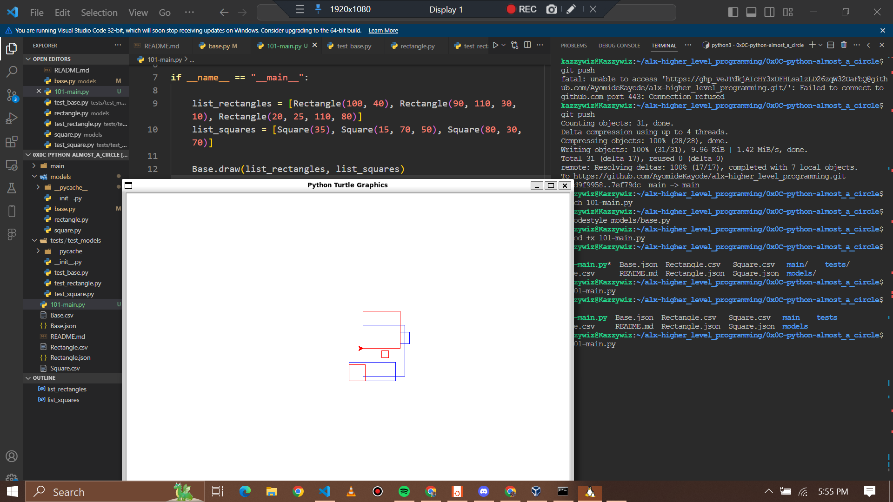

# Project: 0x0C. Python - Almost a circle

<video width="100%" controls loop>
  <source src="./main/Python-Almost-A-Circle.mp4" type="video/mp4">
</video>

## Resources

#### Read or watch:

* [args/kwargs](https://yasoob.me/2013/08/04/args-and-kwargs-in-python-explained/)
* [JSON encoder and decoder](https://docs.python.org/3/library/json.html)
* [unittest module](https://docs.python.org/3.4/library/unittest.html#module-unittest)
* [Python test cheatsheet](https://www.pythonsheets.com/notes/python-tests.html)
## Learning Objectives

### General

* What is Unit testing and how to implement it in a large project
* How to serialize and deserialize a Class
* How to write and read a JSON file
* What is <code>*args</code> and how to use it
* What is <code>**kwargs</code> and how to use it
* How to handle named arguments in a function


## Description of what each file shows (Tasks):
* **main**	--- folder that holds all main.py files provided as test cases.
* **models**	--- folder that holds the main projects functions for submission
* **tests**	--- folder that contains all testcase file for functions written (Unittest module)

0. [If it's not tested it doesn't work](./tests/) : All your files, classes and methods must be unit tested and be PEP 8 validated.
	```sh
	cobby@cobby-VirtualBox:~/alx-higher_level_programming/0x0C-python-almost_a_circle$ python3 -m unittest discover tests
	........
	----------------------------------------------------------------------
	Ran 8 tests in 0.001s

	OK
	cobby@cobby-VirtualBox:~/alx-higher_level_programming/0x0C-python-almost_a_circle$ 
	```
- <em>Note that this is just an example. The number of tests you create can be different from the above example.</em>
1. [Base class](./models/base.py),
	[Python Package](./models/__init__.py) : Write the first class `Base`:
- Create a folder named `models` with an empty file `__init__.py` inside - with this file, the folder will become a Python package
- Create a file named `models/base.py`:
	- Class `Base`:
		- private class attribute `__nb_objects = 0`
		- class constructor: `def __init__(self, id=None):`:
			- if `id` is not `None`, assign the public instance attribute `id` with this argument value - you can assume `id` is an integer and you don’t need to test the type of it
			- otherwise, increment `__nb_objects` and assign the new value to the public instance attribute `id`
- This class will be the “base” of all other classes in this project. The goal of it is to manage id attribute in all your future classes and to avoid duplicating the same code (by extension, same bugs)
	```sh
	cobby@cobby-VirtualBox:~/alx-higher_level_programming/0x0C-python-almost_a_circle$ ls
	0-main.py  README.md  main  models  tests
	cobby@cobby-VirtualBox:~/alx-higher_level_programming/0x0C-python-almost_a_circle$ ./0-main.py 
	1
	2
	3
	12
	4
	cobby@cobby-VirtualBox:~/alx-higher_level_programming/0x0C-python-almost_a_circle$ 
	```
2. [First Rectangle](./models/rectangle.py) : Write the class `Rectangle` that inherits from `Base`:
	- In the file `models/rectangle.py`
	- Class `Rectangle` inherits from `Base`
	- Private instance attributes, each with its own public getter and setter:
	 	- `__width` -> `width`
	 	- `__height` -> `height`
	 	- `__x` -> `x`
	 	- `__y` -> `y`
	- Class constructor: `def __init__(self, width, height, x=0, y=0, id=None):`
	 	- Call the super class with `id` - this super call with use the logic of the `__init__` of the `Base` class
	 	- Assign each argument `width`, `height`, `x` and `y` to the right attribute
- Why private attributes with getter/setter? Why not directly public attribute?
- Because we want to protect attributes of our class. With a setter, you are able to validate what a developer is trying to assign to a variable. So after, in your class you can “trust” these attributes.
	```sh
	cobby@cobby-VirtualBox:~/alx-higher_level_programming/0x0C-python-almost_a_circle$ ./1-main.py 
	1
	2
	12
	cobby@cobby-VirtualBox:~/alx-higher_level_programming/0x0C-python-almost_a_circle$ python3 -m unittest tests/test_models/test_rectangle.py
	........
	----------------------------------------------------------------------
	Ran 8 tests in 0.002s

	OK
	cobby@cobby-VirtualBox:~/alx-higher_level_programming/0x0C-python-almost_a_circle$ 
	```
3. [Validate attributes](./models/rectangle.py) : Update the class `Rectangle` by adding validation of all setter methods and instantiation (`id` excluded):
	- If the input is not an integer, raise the `TypeError` exception with the message: `<name of the attribute> must be an integer`. Example: `width must be an integer`
	- If `width` or `height` is under or equals 0, raise the `ValueError` exception with the message: `<name of the attribute> must be > 0`. Example: `width must be > 0`
	- If `x` or `y` is under 0, raise the `ValueError` exception with the message: `<name of the attribute> must be >= 0`. Example: `x must be >= 0`
	```sh
	cobby@cobby-VirtualBox:~/alx-higher_level_programming/0x0C-python-almost_a_circle$ ./2-main.py 
	[TypeError] height must be an integer
	[ValueError] width must be > 0
	[TypeError] x must be an integer
	[ValueError] y must be >= 0
	cobby@cobby-VirtualBox:~/alx-higher_level_programming/0x0C-python-almost_a_circle$ 
	```
4. [Area first](./models/rectangle.py) : Update the class `Rectangle` by adding the public method `def area(self):` that returns the area value of the `Rectangle` instance.
	```sh
	cobby@cobby-VirtualBox:~/alx-higher_level_programming/0x0C-python-almost_a_circle$ ./3-main.py 
	6
	20
	56
	cobby@cobby-VirtualBox:~/alx-higher_level_programming/0x0C-python-almost_a_circle$ python3 -m unittest tests/test_models/test_rectangle.py
	.........
	----------------------------------------------------------------------
	Ran 9 tests in 0.003s

	OK
	cobby@cobby-VirtualBox:~/alx-higher_level_programming/0x0C-python-almost_a_circle$ 
	```
5. [Display #0](./models/rectangle.py) : Update the class `Rectangle` by adding the public method `def display(self):` that prints in stdout the `Rectangle` instance with the character `#` - you don’t need to handle `x` and `y` here.
	```sh
	cobby@cobby-VirtualBox:~/alx-higher_level_programming/0x0C-python-almost_a_circle$ ./4-main.py 
	####
	####
	####
	####
	####
	####
	---
	##
	##
	cobby@cobby-VirtualBox:~/alx-higher_level_programming/0x0C-python-almost_a_circle$ python3 -m unittest tests/test_models/test_rectangle.py
	...........
	----------------------------------------------------------------------
	Ran 11 tests in 0.002s

	OK
	cobby@cobby-VirtualBox:~/alx-higher_level_programming/0x0C-python-almost_a_circle$ 
	```
6. [__str__](./models/rectangle.py) : Update the class `Rectangle` by overriding the `__str__` method so that it returns `[Rectangle] (<id>) <x>/<y> - <width>/<height>`
	```sh
	cobby@cobby-VirtualBox:~/alx-higher_level_programming/0x0C-python-almost_a_circle$ ./5-main.py 
	[Rectangle] (12) 2/1 - 4/6
	[Rectangle] (1) 1/0 - 5/5
	cobby@cobby-VirtualBox:~/alx-higher_level_programming/0x0C-python-almost_a_circle$ python3 -m unittest tests/test_models/test_rectangle.py
	............
	----------------------------------------------------------------------
	Ran 12 tests in 0.002s

	OK
	cobby@cobby-VirtualBox:~/alx-higher_level_programming/0x0C-python-almost_a_circle$ 
	```
7. [Display #1](./models/rectangle.py) : Update the class `Rectangle` by improving the public method `def display(self):` to print in stdout the `Rectangle` instance with the character `#` by taking care of `x` and `y`
	```sh
	cobby@cobby-VirtualBox:~/alx-higher_level_programming/0x0C-python-almost_a_circle$ python3 -m unittest tests/test_models/test_rectangle.py
	............
	----------------------------------------------------------------------
	Ran 12 tests in 0.005s

	OK
	cobby@cobby-VirtualBox:~/alx-higher_level_programming/0x0C-python-almost_a_circle$ ./6-main.py 


	  ##
	  ##
	  ##
	---
	 ###
	 ###
	cobby@cobby-VirtualBox:~/alx-higher_level_programming/0x0C-python-almost_a_circle$ 
	```
8. [Update #0](./models/rectangle.py) : Update the class `Rectangle` by adding the public method `def update(self, *args):` that assigns an argument to each attribute:
	- 1st argument should be the `id` attribute
	- 2nd argument should be the `width` attribute
	- 3rd argument should be the `height` attribute
	- 4th argument should be the `x` attribute
	- 5th argument should be the `y` attribute
- **This type of argument is called a “no-keyword argument” - Argument order is super important.**
	```sh
	cobby@cobby-VirtualBox:~/alx-higher_level_programming/0x0C-python-almost_a_circle$ ./7-main.py 
	[Rectangle] (1) 10/10 - 10/10
	[Rectangle] (89) 10/10 - 10/10
	[Rectangle] (89) 10/10 - 2/10
	[Rectangle] (89) 10/10 - 2/3
	[Rectangle] (89) 4/10 - 2/3
	[Rectangle] (89) 4/5 - 2/3
	cobby@cobby-VirtualBox:~/alx-higher_level_programming/0x0C-python-almost_a_circle$ python3 -m unittest tests/test_models/test_rectangle.py
	.............
	----------------------------------------------------------------------
	Ran 13 tests in 0.002s

	OK
	cobby@cobby-VirtualBox:~/alx-higher_level_programming/0x0C-python-almost_a_circle$ 
	```
9. [Update #1](./models/rectangle.py) : Update the class `Rectangle` by updating the public method `def update(self, *args):` by changing the prototype to `update(self, *args, **kwargs)` that assigns a key/value argument to attributes:

	- `**kwargs` can be thought of as a double pointer to a dictionary: key/value
		- As Python doesn’t have pointers, `**kwargs` is not literally a double pointer – describing it as such is just a way of explaining its behavior in terms you’re already familiar with
	- `**kwargs` must be skipped if `*args` exists and is not empty
	- Each key in this dictionary represents an attribute to the instance
- **This type of argument is called a “key-worded argument”. Argument order is not important.**
	```sh
	cobby@cobby-VirtualBox:~/alx-higher_level_programming/0x0C-python-almost_a_circle$ ./8-main.py 
	[Rectangle] (1) 10/10 - 10/10
	[Rectangle] (1) 10/10 - 10/1
	[Rectangle] (1) 2/10 - 1/1
	[Rectangle] (89) 3/1 - 2/1
	[Rectangle] (89) 1/3 - 4/2
	cobby@cobby-VirtualBox:~/alx-higher_level_programming/0x0C-python-almost_a_circle$ python3 -m unittest tests/test_models/test_rectangle.py
	..............
	----------------------------------------------------------------------
	Ran 14 tests in 0.003s

	OK
	cobby@cobby-VirtualBox:~/alx-higher_level_programming/0x0C-python-almost_a_circle$ 
	```
10. [And now, the Square!](./models/square.py) : Write the class `Square` that inherits from `Rectangle`:
	- In the file `models/square.py`
	- Class `Square` inherits from `Rectangle`
	- Class constructor: `def __init__(self, size, x=0, y=0, id=None):`:
		- Call the super class with `id`, `x`, `y`, `width` and `height` - this super call will use the logic of the `__init__` of the `Rectangle` class. The `width` and `height` must be assigned to the value of `size`
		- You must not create new attributes for this class, use all attributes of `Rectangle` - As reminder: a Square is a Rectangle with the same width and height
		- All `width`, `height`, `x` and `y` validation must inherit from `Rectangle` - same behavior in case of wrong data
	- The overloading `__str__` method should return `[Square] (<id>) <x>/<y> - <size>` - in our case, `width` or `height`
- <em>As you know, a Square is a special Rectangle, so it makes sense this class Square inherits from Rectangle. Now you have a Square class who has the same attributes and same methods.</em>
	```sh
	cobby@cobby-VirtualBox:~/alx-higher_level_programming/0x0C-python-almost_a_circle$ ./9-main.py 
	[Square] (1) 0/0 - 5
	25
	#####
	#####
	#####
	#####
	#####
	---
	[Square] (2) 2/0 - 2
	4
	  ##
	  ##
	---
	[Square] (3) 1/3 - 3
	9


	 ###
	 ###
	 ###
	cobby@cobby-VirtualBox:~/alx-higher_level_programming/0x0C-python-almost_a_circle$ python3 -m unittest tests/test_models/test_square.py
	......
	----------------------------------------------------------------------
	Ran 6 tests in 0.001s

	OK
	cobby@cobby-VirtualBox:~/alx-higher_level_programming/0x0C-python-almost_a_circle$ python3 -m unittest discover tests
	............................
	----------------------------------------------------------------------
	Ran 28 tests in 0.004s

	OK
	cobby@cobby-VirtualBox:~/alx-higher_level_programming/0x0C-python-almost_a_circle$ 
	```
11. [Square size](./models/square.py) : Update the class Square by adding the public getter and setter size
	- The setter should assign (in this order) the width and the height - with the same value
	- The setter should have the same value validation as the Rectangle for width and height - No need to change the exception error message (It should be the one from width)
	```sh
	cobby@cobby-VirtualBox:~/alx-higher_level_programming/0x0C-python-almost_a_circle$ ./10-main.py 
	[Square] (1) 0/0 - 5
	5
	[Square] (1) 0/0 - 10
	[TypeError] width must be an integer
	cobby@cobby-VirtualBox:~/alx-higher_level_programming/0x0C-python-almost_a_circle$ 
	```
12. [Square update](./models/square.py) : Update the class `Square` by adding the public method `def update(self, *args, **kwargs)` that assigns attributes:
	- `*args` is the list of arguments - no-keyworded arguments
		- 1st argument should be the `id` attribute
		- 2nd argument should be the `size` attribute
		- 3rd argument should be the `x` attribute
		- 4th argument should be the `y` attribute
	- `**kwargs` can be thought of as a double pointer to a dictionary: key/value (keyworded arguments)
	- `**kwargs` must be skipped if `*args` exists and is not empty
	- Each key in this dictionary represents an attribute to the instance
	```sh
	cobby@cobby-VirtualBox:~/alx-higher_level_programming/0x0C-python-almost_a_circle$ ./11-main.py 
	[Square] (1) 0/0 - 5
	[Square] (10) 0/0 - 5
	[Square] (1) 0/0 - 2
	[Square] (1) 3/0 - 2
	[Square] (1) 3/4 - 2
	[Square] (1) 12/4 - 2
	[Square] (1) 12/1 - 7
	[Square] (89) 12/1 - 7
	cobby@cobby-VirtualBox:~/alx-higher_level_programming/0x0C-python-almost_a_circle$ python3 -m unittest tests/test_models/test_square.py
	...........
	----------------------------------------------------------------------
	Ran 11 tests in 0.002s

	OK
	cobby@cobby-VirtualBox:~/alx-higher_level_programming/0x0C-python-almost_a_circle$ 
	```
13. [Rectangle instance to dictionary representation](./models/rectangle.py) :
	- Update the class `Rectangle` by adding the public method `def to_dictionary(self):` that returns the dictionary representation of a `Rectangle`:
	- This dictionary must contain:
		- `id`
		- `width`
		- `height`
		- `x`
		- `y`
	```sh
	cobby@cobby-VirtualBox:~/alx-higher_level_programming/0x0C-python-almost_a_circle$ ./12-main.py 
	[Rectangle] (1) 1/9 - 10/2
	{'id': 1, 'width': 10, 'height': 2, 'x': 1, 'y': 9}
	<class 'dict'>
	[Rectangle] (2) 0/0 - 1/1
	[Rectangle] (1) 1/9 - 10/2
	False
	cobby@cobby-VirtualBox:~/alx-higher_level_programming/0x0C-python-almost_a_circle$ python3 -m unittest tests/test_models/test_rectangle.py
	.................
	----------------------------------------------------------------------
	Ran 17 tests in 0.002s

	OK
	cobby@cobby-VirtualBox:~/alx-higher_level_programming/0x0C-python-almost_a_circle$ 
	```
14. [Square instance to dictionary representation](./models/square.py) :
- Update the class `Square` by adding the public method `def to_dictionary(self):` that returns the dictionary representation of a `Square`:

- This dictionary must contain:
	- `id`
	- `size`
	- `x`
	- `y`
	```sh
	cobby@cobby-VirtualBox:~/alx-higher_level_programming/0x0C-python-almost_a_circle$ ./13-main.py 
	[Square] (1) 2/1 - 10
	{'id': 1, 'size': 10, 'x': 2, 'y': 1}
	<class 'dict'>
	[Square] (2) 1/0 - 1
	[Square] (1) 2/1 - 10
	False
	cobby@cobby-VirtualBox:~/alx-higher_level_programming/0x0C-python-almost_a_circle$ python3 -m unittest tests/test_models/test_square.py 
	.............
	----------------------------------------------------------------------
	Ran 13 tests in 0.002s

	OK
	cobby@cobby-VirtualBox:~/alx-higher_level_programming/0x0C-python-almost_a_circle$ 
	```
15. [Dictionary to JSON string](./models/base.py) : JSON is one of the standard formats for sharing data representation.
	- Update the class `Base` by adding the static method `def to_json_string(list_dictionaries):` that returns the JSON string representation of `list_dictionaries`:
		- `list_dictionaries` is a list of dictionaries
		- If `list_dictionaries` is `None` or empty, return the string: `"[]"`
		- Otherwise, return the JSON string representation of `list_dictionaries`
	```sh
	cobby@cobby-VirtualBox:~/alx-higher_level_programming/0x0C-python-almost_a_circle$ ./14-main.py 
	{'id': 1, 'width': 10, 'height': 7, 'x': 2, 'y': 8}
	<class 'dict'>
	[{"id": 1, "width": 10, "height": 7, "x": 2, "y": 8}]
	<class 'str'>
	cobby@cobby-VirtualBox:~/alx-higher_level_programming/0x0C-python-almost_a_circle$ python3 -m unittest tests/test_models/test_base.py 
	...........
	----------------------------------------------------------------------
	Ran 11 tests in 0.001s

	OK
	cobby@cobby-VirtualBox:~/alx-higher_level_programming/0x0C-python-almost_a_circle$ 
	```
16. [JSON string to file](./models/base.py) : Update the class `Base` by adding the class method `def save_to_file(cls, list_objs):` that writes the JSON string representation of `list_objs` to a file:
	- `list_objs` is a list of instances who inherits of `Base` - example: - list of `Rectangle` or list of `Square` instances
	- If `list_objs` is `None`, save an empty list
	- The filename must be: `<Class name>.json` - example: `Rectangle.json`
	- You must use the static method `to_json_string` <em>(created before)</em>
	- You must overwrite the file if it already exists
	```sh
	cobby@cobby-VirtualBox:~/alx-higher_level_programming/0x0C-python-almost_a_circle$ ./15-main.py 
	[{"id": 1, "width": 10, "height": 7, "x": 2, "y": 8}, {"id": 2, "width": 2, "height": 4, "x": 0, "y": 0}]
	cobby@cobby-VirtualBox:~/alx-higher_level_programming/0x0C-python-almost_a_circle$ python3 -m unittest tests/test_models/test_base.py
	..............
	----------------------------------------------------------------------
	Ran 14 tests in 0.013s

	OK
	cobby@cobby-VirtualBox:~/alx-higher_level_programming/0x0C-python-almost_a_circle$ 
	```
17. [JSON string to dictionary](./models/base.py) :
- Update the class `Base` by adding the static method `def from_json_string(json_string):` that returns the list of the JSON string representation `json_string`:
	- `json_string` is a string representing a list of dictionaries
	- If `json_string` is `None` or empty, return an empty list
	- Otherwise, return the list represented by `json_string`
	```sh
	cobby@cobby-VirtualBox:~/alx-higher_level_programming/0x0C-python-almost_a_circle$ ./16-main.py 
	[<class 'list'>] [{'id': 89, 'width': 10, 'height': 4}, {'id': 7, 'width': 1, 'height': 7}]
	[<class 'str'>] [{"id": 89, "width": 10, "height": 4}, {"id": 7, "width": 1, "height": 7}]
	[<class 'list'>] [{'id': 89, 'width': 10, 'height': 4}, {'id': 7, 'width': 1, 'height': 7}]
	cobby@cobby-VirtualBox:~/alx-higher_level_programming/0x0C-python-almost_a_circle$ python3 -m unittest tests/test_models/test_base.py
	.................
	----------------------------------------------------------------------
	Ran 17 tests in 0.011s

	OK
	cobby@cobby-VirtualBox:~/alx-higher_level_programming/0x0C-python-almost_a_circle$ 
	```
18. [Dictionary to Instance](./models/base.py) : Update the class `Base `by adding the class method `def create(cls, **dictionary):` that returns an instance with all attributes already set:
	- **dictionary can be thought of as a double pointer to a dictionary
	- To use the update method to assign all attributes, you must create a “dummy” instance before:
		- Create a Rectangle or Square instance with “dummy” mandatory attributes (width, height, size, etc.)
		- Call `update` instance method to this “dummy” instance to apply your real values
	- You must use the method `def update(self, *args, **kwargs)`
	- `**dictionary` must be used as `**kwargs` of the method `update`
	- You are not allowed to use `eval`
	```sh
	cobby@cobby-VirtualBox:~/alx-higher_level_programming/0x0C-python-almost_a_circle$ ./17-main.py 
	[Rectangle] (1) 1/0 - 3/5
	[Rectangle] (1) 1/0 - 3/5
	False
	False
	cobby@cobby-VirtualBox:~/alx-higher_level_programming/0x0C-python-almost_a_circle$ python3 -m unittest tests/test_models/test_base.py
	....................
	----------------------------------------------------------------------
	Ran 20 tests in 0.013s

	OK
	cobby@cobby-VirtualBox:~/alx-higher_level_programming/0x0C-python-almost_a_circle$ 
	```
19. [File to instances](./models/base.py) : Update the class `Base` by adding the class method `def load_from_file(cls):` that returns a list of instances:
	- The filename must be: `<Class name>.json` - example: `Rectangle.json`
	- If the file doesn’t exist, return an empty list
	- Otherwise, return a list of instances - the type of these instances depends on `cls` (current class using this method)
	- You must use the from_json_string and `create` methods (implemented previously)
	```sh
	cobby@cobby-VirtualBox:~/alx-higher_level_programming/0x0C-python-almost_a_circle$ ./18-main.py
	[139868627783520] [Rectangle] (1) 2/8 - 10/7
	[139868627783576] [Rectangle] (2) 0/0 - 2/4
	---
	[139868627648584] [Rectangle] (1) 2/8 - 10/7
	[139868627648640] [Rectangle] (2) 0/0 - 2/4
	---
	---
	[139868627869824] [Square] (5) 0/0 - 5
	[139868627871784] [Square] (6) 9/1 - 7
	---
	[139868627648752] [Square] (5) 0/0 - 5
	[139868627648808] [Square] (6) 9/1 - 7
	cobby@cobby-VirtualBox:~/alx-higher_level_programming/0x0C-python-almost_a_circle$ python3 -m unittest tests/test_models/test_base.py
	........................
	----------------------------------------------------------------------
	Ran 24 tests in 0.015s

	OK
	cobby@cobby-VirtualBox:~/alx-higher_level_programming/0x0C-python-almost_a_circle$ python3 -m unittest discover tests
	......................................................
	----------------------------------------------------------------------
	Ran 54 tests in 0.015s

	OK
	cobby@cobby-VirtualBox:~/alx-higher_level_programming/0x0C-python-almost_a_circle$ 
	```
20. [JSON ok, but CSV?](./models/base.py) : Update the class `Base` by adding the class methods `def save_to_file_csv(cls, list_objs):` and `def load_from_file_csv(cls):` that serializes and deserializes in CSV:
	- The filename must be: `<Class name>.csv` - example: `Rectangle.csv`
	- Has the same behavior as the JSON serialization/deserialization
	- Format of the CSV:
		- Rectangle: `<id>,<width>,<height>,<x>,<y>`
		- Square: `<id>,<size>,<x>,<y>`
	```sh
	cobby@cobby-VirtualBox:~/alx-higher_level_programming/0x0C-python-almost_a_circle$ ./100-main.py 
	[140576089538344] [Rectangle] (1) 2/8 - 10/7
	[140576089538400] [Rectangle] (2) 0/0 - 2/4
	---
	[140576089441392] [Rectangle] (1) 2/8 - 10/7
	[140576089441336] [Rectangle] (2) 0/0 - 2/4
	---
	---
	[140576089624648] [Square] (5) 0/0 - 5
	[140576089626608] [Square] (6) 9/1 - 7
	---
	[140576089441560] [Square] (5) 0/0 - 5
	[140576089441616] [Square] (6) 9/1 - 7
	cobby@cobby-VirtualBox:~/alx-higher_level_programming/0x0C-python-almost_a_circle$ python3 -m unittest tests/test_models/test_base.py
	.............................
	----------------------------------------------------------------------
	Ran 29 tests in 0.012s

	OK
	cobby@cobby-VirtualBox:~/alx-higher_level_programming/0x0C-python-almost_a_circle$ 
	```
21. [Let's draw it](./models/base.py) : Update the class `Base` by adding the static method `def draw(list_rectangles, list_squares):` that opens a window and draws all the `Rectangles` and `Squares`:
	- You must use the [Turtle graphics module](https://docs.python.org/3.0/library/turtle.html)
	- To install it: `sudo apt-get install python3-tk`
	- To make the GUI available outside your vagrant machine, add this line in your Vagrantfile: `config.ssh.forward_x11 = true`
	- No constraints for color, shape etc… be creative!
	```sh
	cobby@cobby-VirtualBox:~/alx-higher_level_programming/0x0C-python-almost_a_circle$ ./101-main.py
	.....(see below picture for result)
	```
	

	[Video Representation.](https://twitter.com/kazzy_wiz/status/1713976783542903117)

- Additional info below: <em>(didn't need these because I was operating on Ubuntu - VsCode🤭 and I just made sure to install the Turtle graphics module with the command above in my Ubuntu terminal - see [pic](./main/turtle-install.PNG). Also, remember to `import turtle` in the `Base.py` file.)</em>
	- Uncommented line in `/etc/ssh/ssh_config` that said `# ForwardX11 no` and change `no` to `yes`.
	- Then added line `config.ssh.forward_agent = true` to my Vagrantfile in addition to `config.ssh.forward_x11 = true`.
	- Halted my vm with `vagrant halt` and started it back up with `vagrant up --provision` then `vagrant ssh`.
	- If you get an error that looks like /usr/bin/xauth: timeout in locking authority file /home/vagrant/.Xauthority, then enter `rm .Xauthority` (you may have to `sudo`).
	- Logout and restart the vm with `vagrant up --provision`.
	- Test with `xeyes`. If Xquartz is installed on the Mac OS it should open in an Xquartz window.

- When all is said and done, make sure the Unittests are passing succesfully:
	```sh
	cobby@cobby-VirtualBox:~/alx-higher_level_programming/0x0C-python-almost_a_circle$ python3 -m unittest discover tests
	...........................................................
	----------------------------------------------------------------------
	Ran 59 tests in 0.031s

	OK
	cobby@cobby-VirtualBox:~/alx-higher_level_programming/0x0C-python-almost_a_circle$ python3 -m unittest tests/test_models/test_base.py
	.............................
	----------------------------------------------------------------------
	Ran 29 tests in 0.022s

	OK
	cobby@cobby-VirtualBox:~/alx-higher_level_programming/0x0C-python-almost_a_circle$ python3 -m unittest tests/test_models/test_rectangle.py
	.................
	----------------------------------------------------------------------
	Ran 17 tests in 0.002s

	OK
	cobby@cobby-VirtualBox:~/alx-higher_level_programming/0x0C-python-almost_a_circle$ python3 -m unittest tests/test_models/test_square.py
	.............
	----------------------------------------------------------------------
	Ran 13 tests in 0.002s

	OK
	cobby@cobby-VirtualBox:~/alx-higher_level_programming/0x0C-python-almost_a_circle$ 
	```
---
### Environment
* Language: Python 3.4.3
    * OS: Ubuntu 14.04 LTS
    * Compiler: python3
    * Style guidelines:
        - [PEP 8 (version 1.7)](https://www.python.org/dev/peps/pep-0008/)

---
## Author

Feel free to reach out to me through any of the following channels:

[](https://beacons.ai/cobbysefahsolomon)


[](mailto:solomonsefah13@gmail.com)
[](https://twitter.com/hunterxcobby)
[](https://www.linkedin.com/in/cobby-sefah-solomon-~-c-s-s-6460bb279/)
[](https://www.instagram.com/cobby_is_a_god)
[](https://wa.me/233557452729)

