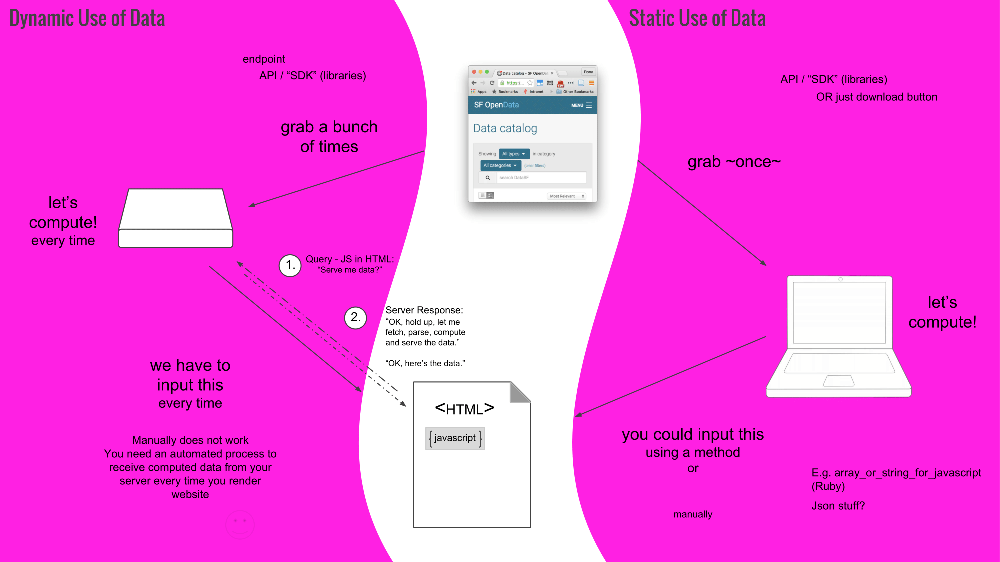

# Dealing with data statically versus dynamically

We often use the terms “static” and “dynamic” when it comes to websites. A static website is unchanging and stays the same regardless of how we interact with it. A dynamic website has content and/or presentation that can change (courtesy of scripts that loads every time the site is loaded). The same static-dynamic concept can be applied to data handling. If you deal with data statically, you’re using your dataset as a fixed set of values; if you deal with data dynamically, you’re using it as a set of data that changes over time.

In today’s project you have a choice about how to handle the data: dynamically or statically. For instance, if you wanted to have a bar chart of the number of tech workers relative to other workers living in San Francisco, and you wanted this chart to always pull from the latest data on SF Open Data, you’d want your code to fetch, parse, and compute the data every time your visualization is rendered. On the other hand, if you wanted bar charts that show the ratio of workers at specific points in time (e.g., 5 years ago compared to now), there’s really no point fetching, parsing and computing the data every time your visualization is rendered. You just need to download or pull the data to your local server, compute the numbers you want, and add it to your Javascript one time. This means that you are working with a static set of data.

